# ml

Forecasting on top of the pipeline in the repo root. Given what is known about a metro at a quarter, how much does its house price index move over the next one, two, four and eight quarters, and how sure can the model be.

Headline: a sequence GRU cuts the no-change error 45 percent at four quarters and 44 percent at eight, wins both long horizons outright, and its bands run 29 to 36 percent narrower than the metro's own long run average.

## The Input

| item | value |
|---|---|
| file | `../data/integrated/hpi_census_merged.csv` |
| rows x cols | 1,197 x 24 |
| metros | 410, of which 37 are metropolitan divisions |
| years | 2014, 2019, 2024 |
| sha256 | `ce2322ba9a7a6c938db3b2616baadf95ecdbd528d64ed0598d5e4d93394e9d4b` |

Read only. This folder never writes to `data/`. If the pipeline re-runs, the hash in the loader is updated in the same commit.

## The Setup

```bash
cd ml
python3.12 -m venv .venv
.venv/bin/pip install -r requirements.txt
.venv/bin/pip install -e .
.venv/bin/python run_tests.py
```

Run the whole chain from the repo root:

```bash
ml/.venv/bin/python -m loop.panel
ml/.venv/bin/python -m loop.baselines
ml/.venv/bin/python -m loop.train
ml/.venv/bin/python -m loop.export
ml/.venv/bin/python -m bot.build_map_data
```

About four minutes on an M4. Every step leaves a figure in `results/figures/`.

## The Panel

One row per metro per quarter. 410 metros, 1975Q1 to 2026Q2, 71,072 rows. FHFA all-transactions gives the target.

Fourteen features feed the models. Seven more columns ride along for the figures and the map without reaching a model, and why is in The Models below.

Nothing leaks. A monthly value is known in its month. An annual value for year Y is known only from the first quarter of Y+1. Divisions inherit what they lack from the parent metro. `results/panel_manifest.json` records row counts, the non-null share of every column and the parquet hash.

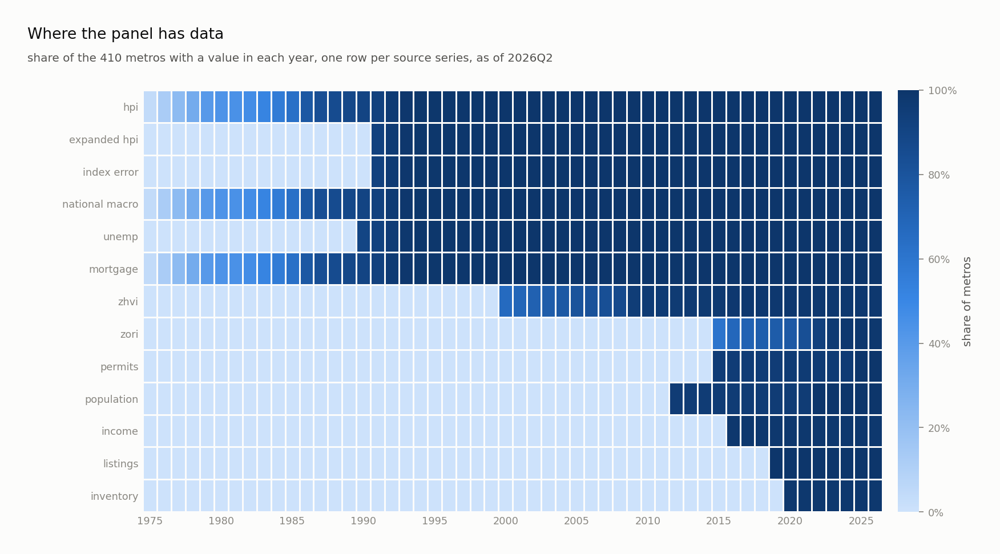

Prices go back fifty years. Unemployment starts 1990, the mortgage rate 1971, the expanded index 1991, Zillow values 2000, rents 2015, listings 2016. Covariates still arrive late, so the network carries a presence mask per feature.

How late matters more than it looks. A feature is only teachable where the model is fitted, and the fitting block ends in 2017, so the share of FITTING samples a feature reaches is the number that decides whether it can be learned at all:

| feature | share of fitting samples | share of test samples |
|---|---|---|
| price growth | 0.99 | 1.00 |
| mortgage rate | 1.00 | 1.00 |
| expanded index and its error | 0.73 / 0.76 | 1.00 |
| unemployment | 0.79 | 1.00 |
| Zillow home values | 0.40 | 0.98 |
| population and migration | 0.14 | 0.99 |
| permits | 0.06 | 0.97 |
| income | 0.03 | 0.99 |
| listing prices and inventory | 0.00 | 1.00 |

Read the last row carefully. Listings and inventory are present in every test sample and absent from every fitting one, so the model was being scored on information it had never once been taught to use. Deepening the two sources that could be deepened moved unemployment from 0.09 to 0.79 and the mortgage rate from 0.50 to 1.00, and that alone cut validation loss from 0.006602 to 0.006564.

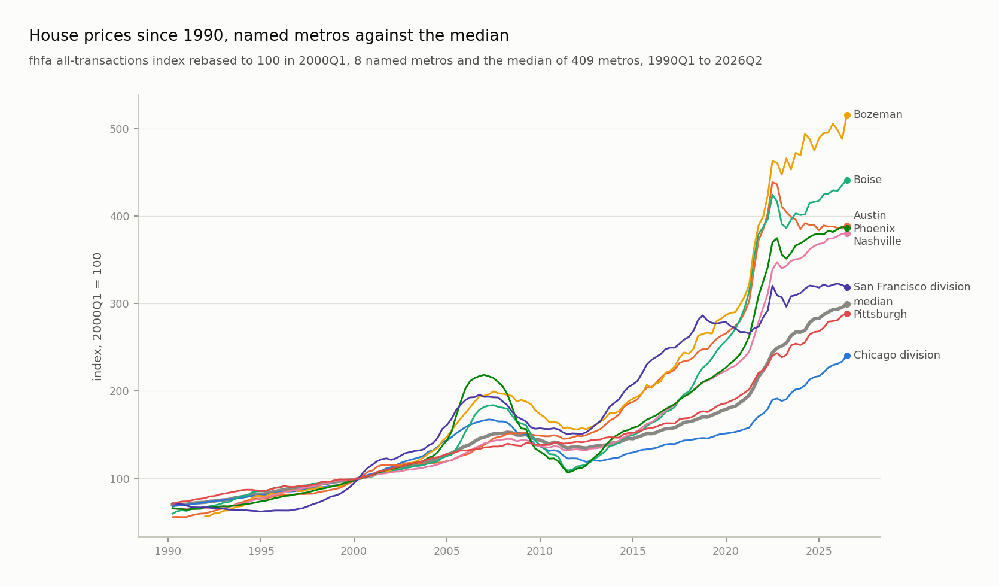
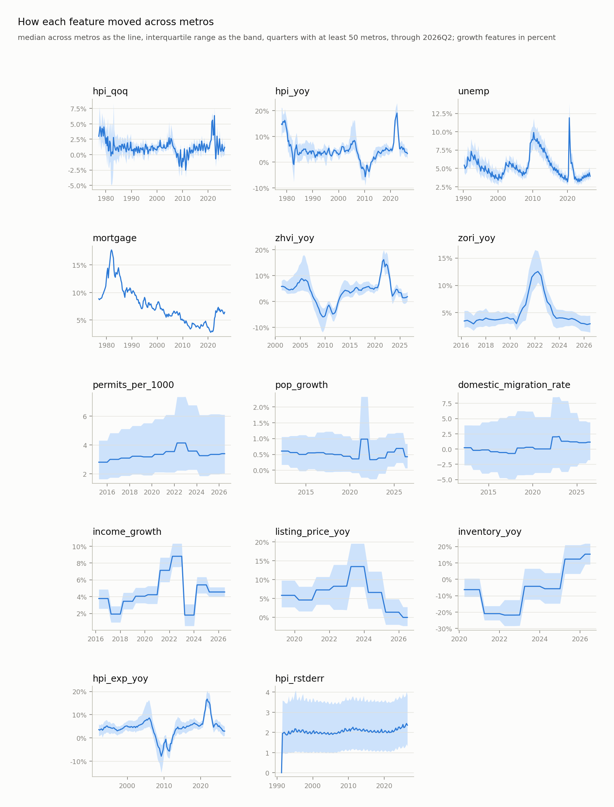
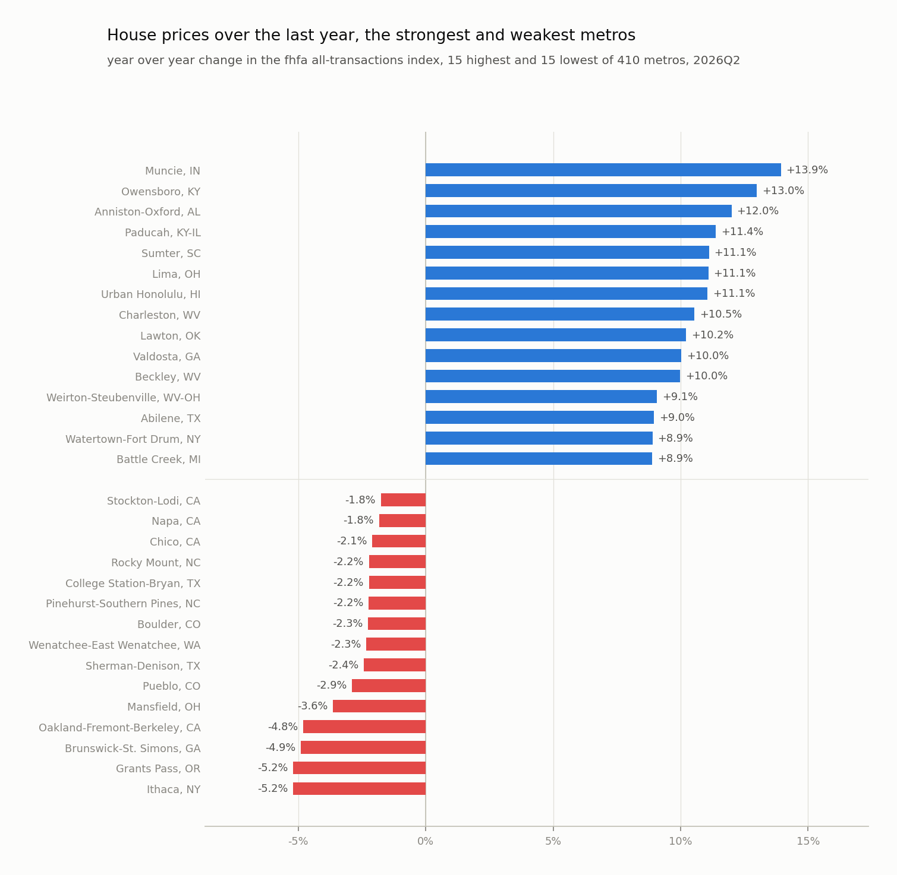

## The Evaluation Design

This is the part that makes the numbers mean anything.

The target is log growth of the index over h quarters. A sample is one metro, one origin quarter, one horizon. It lands in a block by where its outcome falls:

| block | outcome realized | used for |
|---|---|---|
| train | by 2017Q4 | fitting |
| calibration | 2018 to 2021 | band width only |
| test | 2022Q1 or later | scored once |

The outcome quarter decides the block and nothing else does, so one origin sits in
different blocks at different horizons. Nothing realized after 2021 reaches a model
judged on 2022 onward.

An earlier version of `spec.block` read calibration and test off the origin instead.
That left 3,280 calibration samples at eight quarters where the rule gives 6,560, and
all of them landed in the 2020 to 2021 boom, so every published band width came off
two years of the least representative data in the panel. It also discarded every
sample whose outcome crossed a block edge. The blocks are horizon independent now,
6,560 calibration and about 7,375 test samples at each horizon.

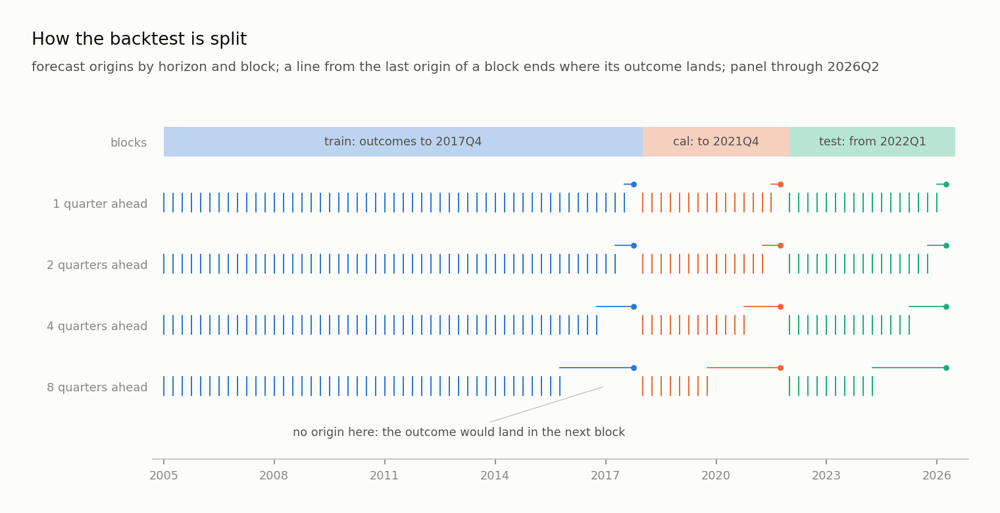

Bands come from conformalized quantile regression. The model predicts the 10th, 50th and 90th percentiles. The calibration block sets the smallest widening of that band covering at least 90 percent of held-out outcomes, with the finite sample correction of Romano, Patterson and Candes (2019).

That guarantee assumes exchangeable samples. Quarters are not exchangeable. So the test block coverage is the honest number, and it is reported beside every model.

## The Models

Five classical rules set the bar: no change, momentum, the metro's own average growth, ridge on price lags and covariates, and gradient boosting with quantile losses.

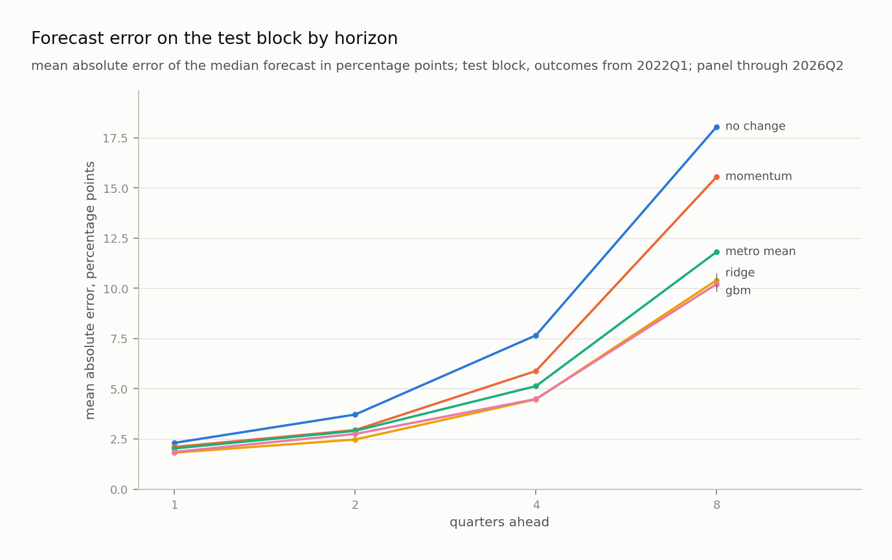
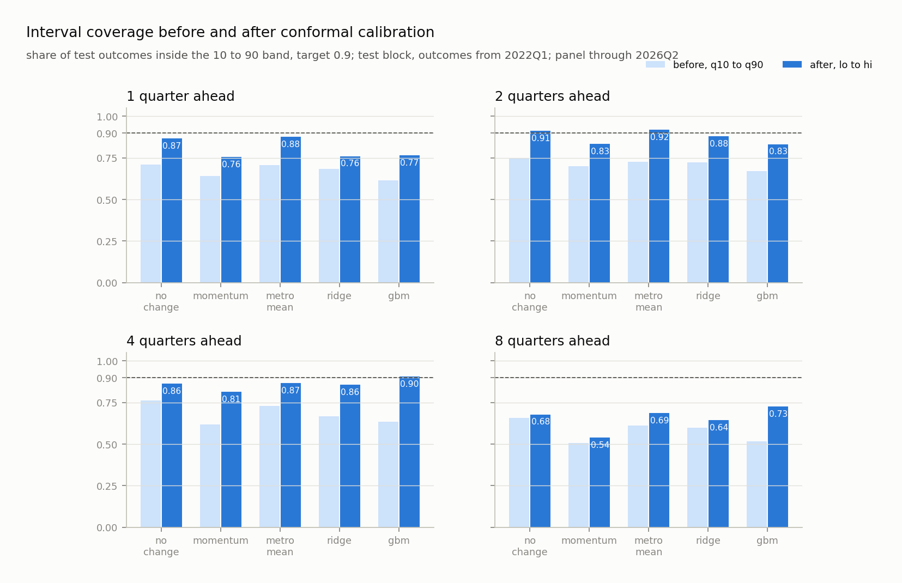
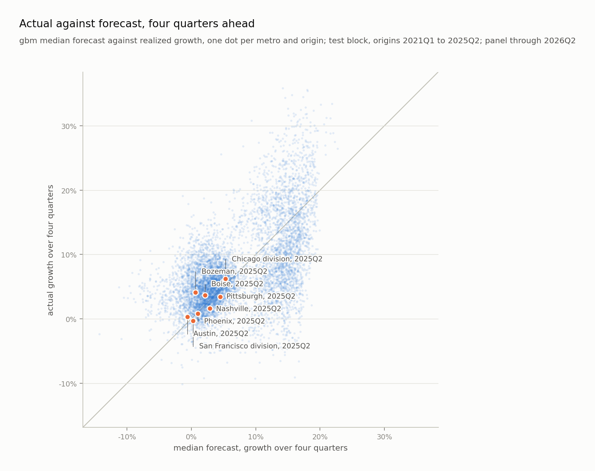

Two networks share one input: 24 quarters of ten series with a presence mask each, four annual features at the origin, and a learned embedding per metro. The window MLP flattens it into a three layer perceptron. The sequence GRU reads it as a sequence, then concatenates the final state with the annual features and the embedding. Both emit three monotone quantiles per horizon and train on pinball loss with Adam, weight decay and early stopping.

Learning rate, weight decay and the input set are chosen on validation loss alone, never on test. The validation set is the tail of the fitting block, outcomes realized 2015 to 2017.

Two of those ten series are new, and both come from a file FHFA publishes beside the index and this project had downloaded and never read. `hpi_exp_metro.txt` carries the expanded-data index, a second FHFA estimate of the same metro quarter built from more records, and `rstderr`, the standard error FHFA reports for it. The error is the only published measure of how thin a metro's repeat-sale record is, and the model has no other way to know that Hinesville is measured to within 3.7 percent while Denver is measured to within 0.05.

Candidate inputs, each fitted the same way and read on validation loss:

| input set | validation loss |
|---|---|
| ten series, the shipped set | 0.006202 |
| plus both forms of the index error | 0.006199 |
| expanded index, no error | 0.006228 |
| the error as a percent of the index instead of index points | 0.006225 |
| eight series, no expanded index | 0.006564 |
| plus the metro against the cross section median | 0.006565 |
| plus the calendar quarter as a sine and cosine | 0.006565 |
| plus CPI, the ten year, the term spread and national unemployment | 0.006618 |

The expanded index carries most of the gain and the error adds the rest. Carrying both forms of the error buys 0.000003, which is noise, so the simpler set stays. The four national series are worse than not having them: one number shared by all 410 metros tells a window which era it sits in and nothing about the place, which is the same answer an earlier experiment on the metro running mean and the national mean gave. The rejected columns stay in the panel as `spec.CONTEXT`, out of reach of every model, because a negative result that is one command from being re-run is worth more than one written down.

`ablate.py` reproduces the table. It reads the validation block and nothing else.

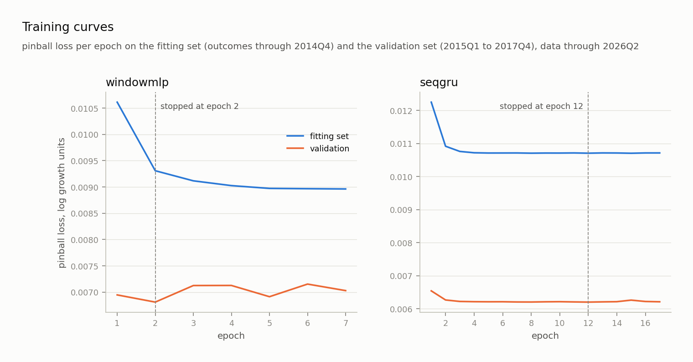
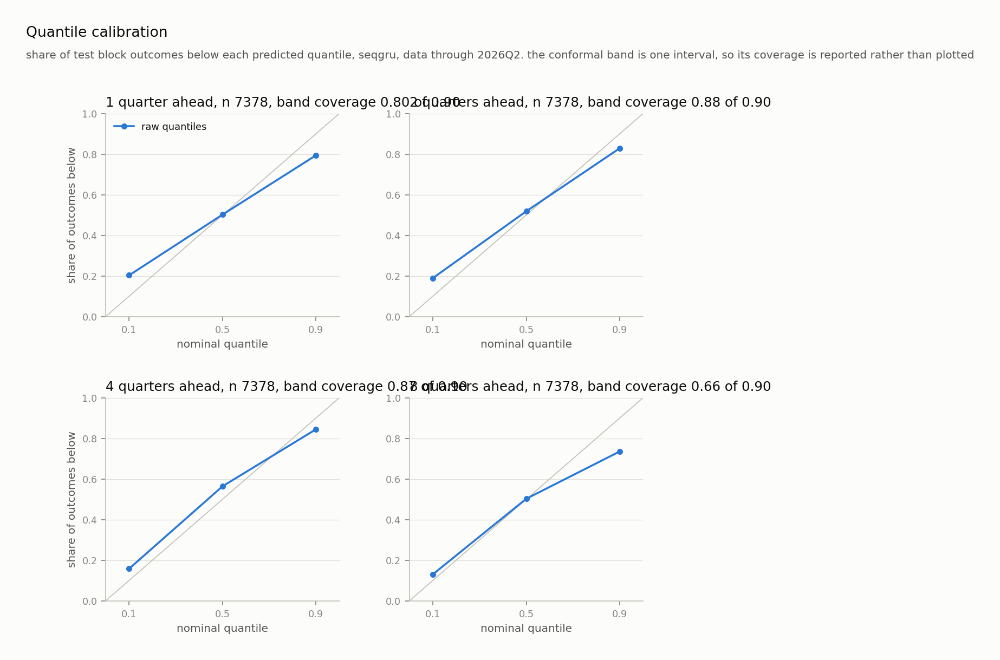

## The Results, 2022Q1 to 2026Q2

Mean absolute error of the median forecast, in percentage points of growth. Coverage is the share of outcomes inside the 90 percent band.

| model | 1q | 2q | 4q | 8q | coverage 1q/2q/4q/8q |
|---|---|---|---|---|---|
| no change | 2.30 | 3.72 | 7.66 | 18.05 | 0.87 / 0.91 / 0.86 / 0.68 |
| momentum | 2.10 | 2.94 | 5.89 | 15.56 | 0.76 / 0.83 / 0.81 / 0.54 |
| metro mean | 2.02 | 2.90 | 5.13 | 11.82 | 0.88 / 0.92 / 0.87 / 0.69 |
| ridge | 1.82 | 2.47 | 4.47 | 10.41 | 0.76 / 0.88 / 0.86 / 0.64 |
| gradient boosting | 1.86 | 2.75 | 4.49 | 10.22 | 0.77 / 0.83 / 0.90 / 0.73 |
| window mlp | 2.18 | 3.39 | 6.58 | 15.28 | 0.82 / 0.91 / 0.92 / 0.69 |
| sequence gru | 1.93 | 2.57 | 4.20 | 10.14 | 0.80 / 0.88 / 0.87 / 0.66 |

Every model on this table improved when the two FHFA columns joined, because every model gets the same inputs. That is the point of a shared evaluation frame: a new feature has to beat the classical rules holding the same feature, not the version of them that never saw it.

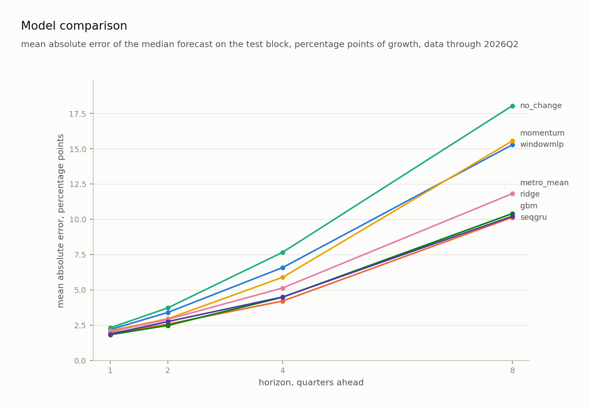

Three honest readings of that table.

- The GRU wins where the horizon is long, by 0.27 points over ridge at four quarters and 0.27 at eight, and ridge wins the short ones, by 0.11 at one quarter and 0.09 at two. A penalised linear model on the same features is hard to beat one quarter out, and that is worth saying out loud. The GRU does beat the metro's own fifty year average at every horizon, which is the rule that matters: a long mean is a good guess at a trend and a bad one across a boom, and it degrades from 5.13 to 11.82 as the horizon doubles while the GRU goes 4.20 to 10.14.
- Gradient boosting is the closest rival at eight quarters, 10.22 against 10.14. Eight tenths of a percentage point of error over two years is not a gap anyone should bet on, and the GRU's case at that horizon rests on its band being narrower, not on those 0.08 points.
- The GRU earns its place on the bands. At four quarters its band is 29 percent narrower than the long run average's, at 0.87 coverage against 0.87. At eight quarters it is 36 percent narrower for 0.66 against 0.69.
- Every model under-covers at eight quarters, the GRU at 0.66 against a nominal 0.90. That is the honest cost of a fixed calibration window, and it is read out in The Limits below rather than smoothed over.

The window MLP now beats no change at every horizon, which it did not before the two FHFA columns arrived, but it is behind the metro's own long run average at every horizon. It is kept as the honest answer to what a plain perceptron does here.

## The Shipped Forecast

The GRU refitted on every outcome realized by 2026Q2, at the epoch count found above. Its band margin is out of sample: a second GRU fitted through 2021, calibrated on 2022 to 2026, and that margin applied to the final quantiles.

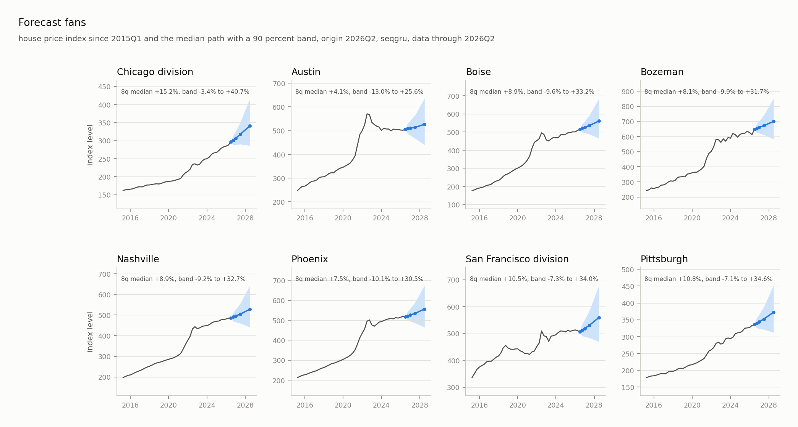
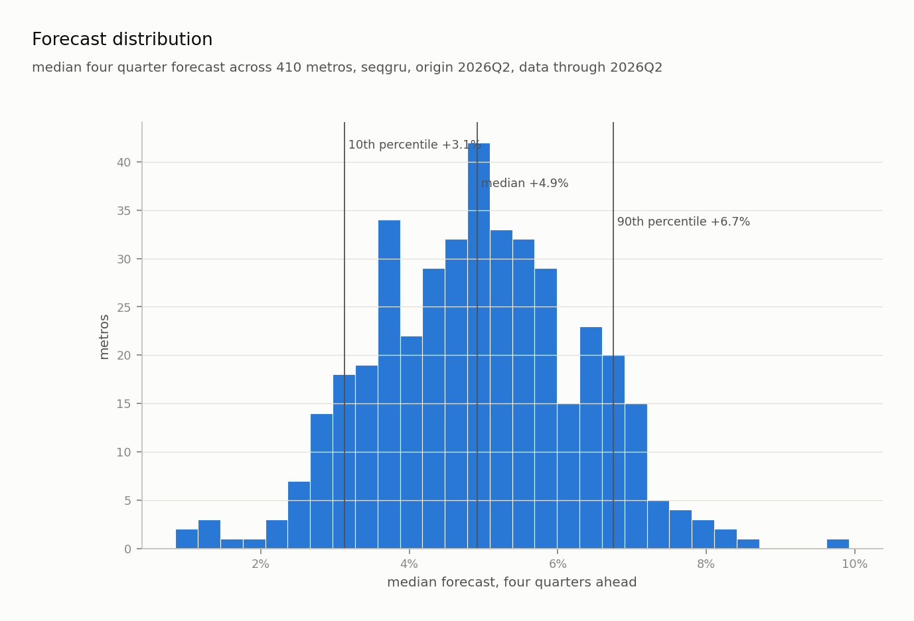

At the 2026Q2 origin the median four quarter forecast across 410 metros is 4.9 percent (10th to 90th percentile 3.1 to 6.7), positive everywhere, the weakest metro at 0.9. The eight quarter median is 10.8 percent.

| where | metros | four quarter |
|---|---|---|
| highest | Elmira, Weirton-Steubenville, Lima, Muncie, Erie | 8 to 10 percent |
| lowest | Punta Gorda, Cape Coral, Sherman-Denison, Ithaca, Austin | under 1.5 percent |
| Chicago division | | 7.2 percent, band -2.2 to 18.5 |

Every band is wide. That is the point of publishing one.

`export.py` writes the map's metrics contract to `results/forecast/metrics.csv`: expected growth at four and eight quarters with bands, realized growth over the last four, the five year annualized trend, the surprise, and the index standard error. The map shows them under Forecasts.

The index error is not a forecast and is credited to FHFA, not to the model. It rides in this file because nothing else on the map carries it, and it belongs beside a forecast because it says how firmly the thing being forecast is even measured. At 2026Q2 it runs from 0.05 percent in Denver and 0.06 in Phoenix, which are deep liquid markets, to 3.7 in Hinesville and 3.6 in Lawton, which are small and thinly traded. A wide error there is a reason to read the forecast above it loosely.

## The Limits

- The calibration block is fixed at 2018 to 2021 by choice, and every model under-covers at eight quarters because of it, 0.54 to 0.73 against a nominal 0.90. Conformal coverage is guaranteed only for exchangeable samples. Calibration outcomes land in 2018 to 2021, which is the run up and the boom; test outcomes land in 2022 onward, which is the correction. The two regimes are not exchangeable and no margin fitted on the first covers the second. Rolling the calibration window forward would fix it by calibrating on the period being scored, which is leakage, so the number is reported rather than repaired. A wider held out period, or a conformal method built for distribution shift, is the real answer.
- Rents reach 2015 and Zillow values 2000, so both are thin where the model is fitted. Unemployment and the mortgage rate used to be in that list and are not any more.
- Listing and inventory exist only as annual means, and keeping their monthly history would sharpen what the model is handed at forecast time. It would not teach it anything. Those series are 0.00 of the fitting block at any sampling rate, so the fix is a later fitting era, not a better collector, and a later fitting era buys fewer years to learn from. That trade has not been made here.
- The band is very nearly one national width. At four quarters it runs 18.9 to 21.8 percentage points across all 410 metros, a standard deviation of 0.4 on a median of 20.2. That is the conformal step doing what it was built to do: `spec.apply_margin` adds one scalar per horizon to every metro alike, so all the per-metro variation has to come from the quantile heads, and they barely provide any. The model is now handed a published measurement error per metro, which is precisely the quantity that should widen a thin market's band and narrow a deep one's, and none of it reaches the band. A conformal method with a per-metro score, or a margin scaled by the index error, is the obvious next thing to try, and it has not been tried.
- A band that looks far too wide against one year is not too wide. The middle 90 percent of the misses at the 2025Q2 origin span about 9 points against a 20 point band, which invites the conclusion that the interval is doubled. It is not: the band has to cover where prices actually land, and across the whole test block the realized four quarter spread is 20.4 points against a median band of 17.9, which is why coverage is 0.87 and not 0.97. One origin's cross section is one draw of the cycle.
- The model never forecasts a fall. At the 2026Q2 origin the weakest of 410 metros is plus 0.9 percent, and the cross metro standard deviation of the four quarter forecast is 1.4 points against a realized miss standard deviation of 2.8. It separates metros less than it misses them, and it has no way to say that a particular metro is about to decline, which several did in the year just scored.
- The index standard error is fitted as index points, and FHFA rebases every metro to 100 at its own start, so the same number means different things in two metros. Expressed as a percent of the index it is scale free and slightly worse on validation, 0.006225 against 0.006202. The metro embedding is the likely reason the raw form survives, and the percent form is what ships to the map, where a reader is comparing metros and the model is not.

## The Layout

```
src/loop/      package code. spec.py is the contract every module imports
tests/         unittest suite, run with run_tests.py
results/       manifests, backtest tables, forecasts, figures. tracked
data/ models/  built panel and trained artifacts. gitignored
MILESTONES.md  the build plan
```

## The Roadmap

| wave | adds | status |
|---|---|---|
| forecasting | quarterly panel, backtest, five baselines, two torch models, conformal bands, map export | done |
| 1 baseline | features, ridge/lasso, gradient boosting, residual analysis | in progress |
| 2 scenarios | conditional sampling, then a small VAE if it earns its place | planned |
| 3 dashboard | streamlit app, public link | planned |
